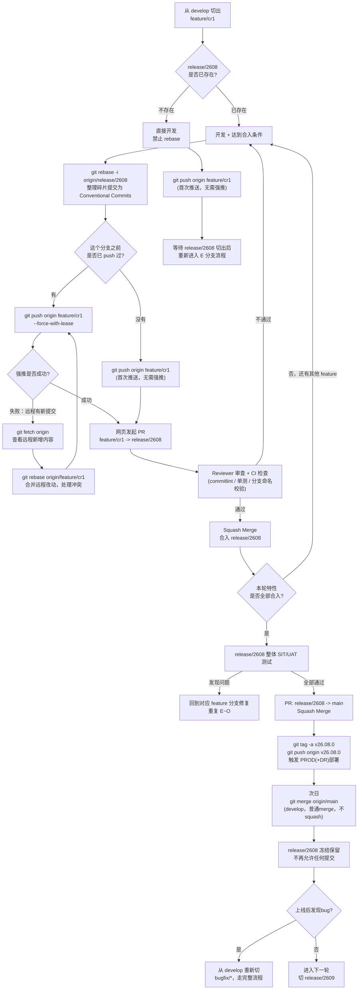

# 完整流程：从特性分支到 Release 上线

汇总本次讨论确定的完整链路：特性开发 → rebase 整理 → push（含强推分支）→ PR → Squash Merge → release 上线 → 回merge develop。

---

## 一、整体流程图



---

## 二、三种命令情况对照

| 情况 | 触发条件 | 命令 |
|---|---|---|
| **无需 rebase，直接 push** | release 尚未切出，或已 rebase 但这是该分支第一次推送到远程 | `git push origin feature/cr1` |
| **rebase 后，需要强推** | release 已存在，做了 `rebase -i` 整理，且这个分支之前已经 push 过 | `git push origin feature/cr1 --force-with-lease` |
| **强推失败，需要处理冲突** | 强推时远程分支已被他人更新（跟你上次 fetch 时不一致） | `git fetch origin` → `git rebase origin/feature/cr1` 解决冲突 → 重新 `--force-with-lease` |

---

## 三、按阶段完整命令串联

### 阶段 1：切出 feature 分支

```bash
git checkout develop
git pull
git checkout -b feature/cr1-payment-gateway
```

### 阶段 2：开发（release/2608 尚未存在时，禁止 rebase）

```bash
git add . && git commit -m "wip"
git add . && git commit -m "fix typo"
# ...自由提交，不整理...

git push origin feature/cr1-payment-gateway   # 首次推送，无需强推
```

### 阶段 3：release/2608 切出后，达到合入条件，整理提交

```bash
git rebase -i origin/release/2608
# 编辑器中把碎片提交 pick 改为 squash
# 整理最终 message 为：feat(payment): 新增支付网关功能
```

### 阶段 4：推送（区分是否第一次）

```bash
# 这个分支之前没 push 过
git push origin feature/cr1-payment-gateway

# 这个分支之前已经 push 过（现在因为 rebase 历史变了）
git push origin feature/cr1-payment-gateway --force-with-lease
```

**若强推失败：**

```bash
git fetch origin
git log origin/feature/cr1-payment-gateway --oneline -5   # 看看远程多了什么
git rebase origin/feature/cr1-payment-gateway              # 合并远程改动，解决冲突
git push origin feature/cr1-payment-gateway --force-with-lease
```

### 阶段 5：发起 PR（网页操作）

```
源分支：feature/cr1-payment-gateway
目标分支：release/2608
PR 标题：feat(payment): 新增支付网关功能
```

### 阶段 6：Review + CI 检查（自动/人工）

不通过则回到阶段 2/3 修复，重新走一遍。

### 阶段 7：Squash Merge（网页操作）

审查通过后，合并按钮选 **Squash and merge**，合入 `release/2608`。

其他特性重复阶段1~7，陆续合入同一个 `release/2608`；未达标特性不推送、不发 PR，顺延下一轮。

### 阶段 8：release/2608 整体测试

发现问题：回到对应 feature 分支修复，重复阶段3~7（rebase 对齐 release/2608）。

### 阶段 9：全部通过，上线，合并到 main

```bash
# PR: release/2608 -> main（Squash Merge，网页操作）

git checkout main
git pull
git tag -a v26.08.0 -m "release: 2608 batch release"
git push origin v26.08.0   # 触发 PROD(+DR) 部署
```

### 阶段 10：次日回merge到 develop

```bash
git checkout develop
git pull
git merge origin/main       # 普通merge，不squash
git push origin develop
```

### 阶段 11：release 冻结，处理后续 bug

```bash
# release/2608 保留不删，不再允许任何提交

# 如果上线后发现bug：
git checkout develop
git pull
git checkout -b bugfix/CR2610-fix-payment-issue
# 走完整流程（阶段2~10），合入下一轮 release/2609 或走 hotfix/* 通道
```

---

## 四、关键判断速查

| 判断点 | 规则 |
|---|---|
| 什么时候能 rebase | 只有对应 release 分支已存在时才允许，且必须对齐这个 release |
| 什么时候要强推 | rebase 改写了历史 + 这个分支之前已经 push 过 |
| 强推失败怎么办 | 先 fetch 看远程变化，rebase 合并后再重推，不要改用裸 `--force` |
| 什么时候 Squash Merge | `feature → release`、`release → main`，全部走 Squash Merge |
| 什么时候普通 merge | 仅 `main → develop` 回merge这一步，保留完整历史 |
| release 上线后能不能改 | 不能，冻结保留，bug 走新分支流程 |
